<div align="center">

# InsightAI — Ask your business data questions in plain English

**Upload any CSV or Excel → ask in plain English → get answers with charts.
No SQL. No BI tool. No data engineer needed.**

Built by **Somy Srivastava**

[](https://www.python.org/)
[](https://fastapi.tiangolo.com/)
[](https://react.dev/)
[](https://www.postgresql.org/)
[](https://valkey.io/)
[](https://docs.celeryq.dev/)
[](https://www.docker.com/)
[](https://openai.com/)
[](#tests)
[](#tests)

</div>

---

## Screenshots

<table>
<tr>
<td width="50%">

**Sign in**
<br>
Email/password auth, JWT-backed.
<br><br>
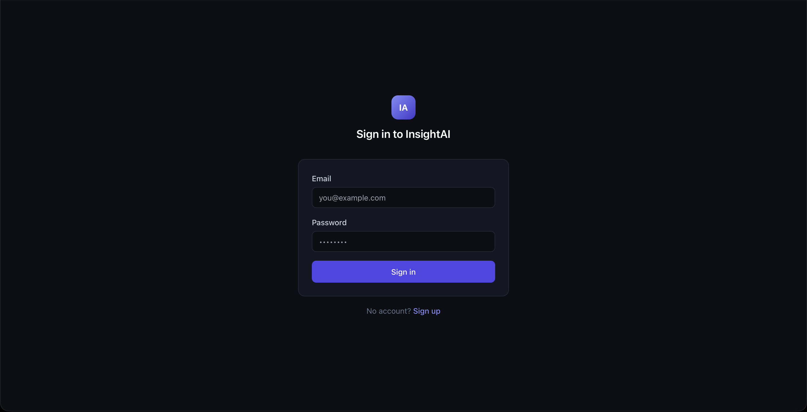

</td>
<td width="50%">

**Upload a dataset**
<br>
Drag and drop a CSV or Excel file — no schema setup.
<br><br>
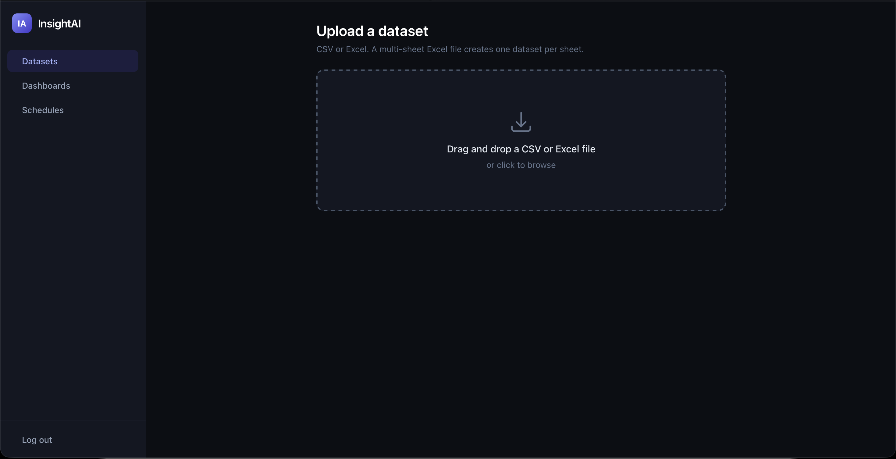

</td>
</tr>
<tr>
<td width="50%">

**Explore the dataset**
<br>
Every column, its type, and a box to ask anything.
<br><br>
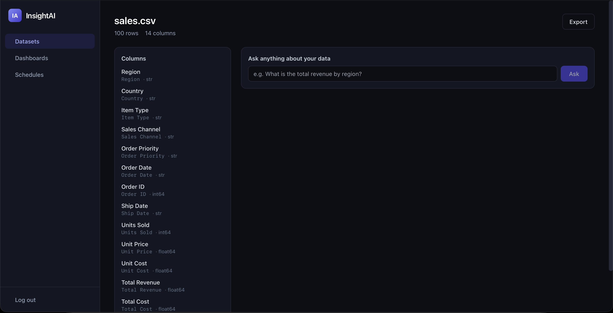

</td>
<td width="50%">

**Ask in plain English**
<br>
"Which region had the highest total revenue?" → a written answer,
a chart, and the underlying table, computed from the real data.
<br><br>
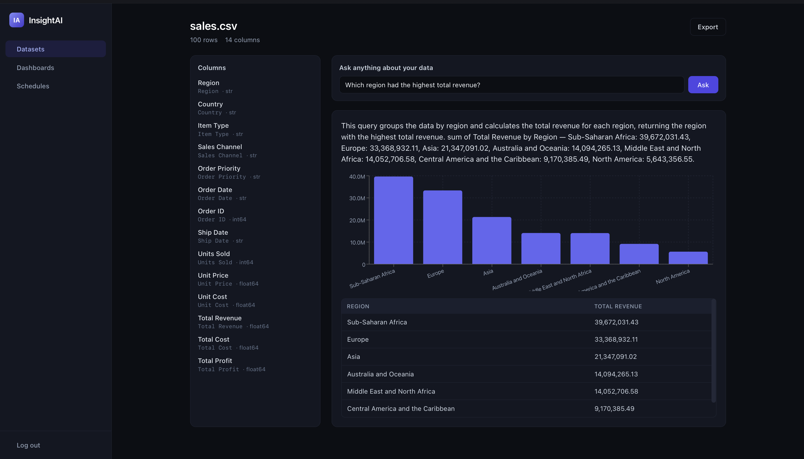

</td>
</tr>
<tr>
<td width="50%">

**Pin answers to a dashboard**
<br>
Save a query as a live, refreshable dashboard tile.
<br><br>
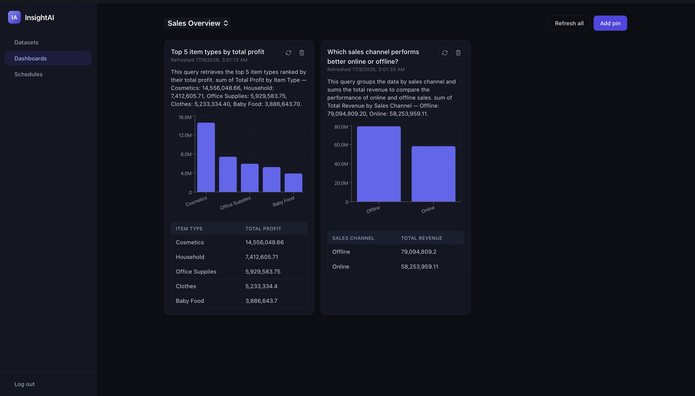

</td>
<td width="50%">

**Multi-sheet Excel, handled automatically**
<br>
One `.xlsx` upload with 4 sheets became 4 independent,
independently-queryable datasets.
<br><br>
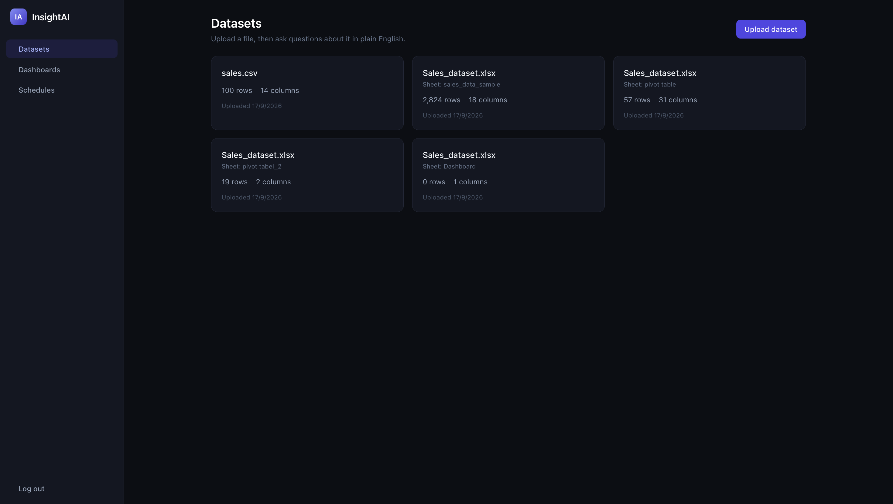

</td>
</tr>
<tr>
<td width="50%">

**Schedule a recurring report**
<br>
Pick a dataset, a question (or a full report), a cadence, and who
gets it.
<br><br>
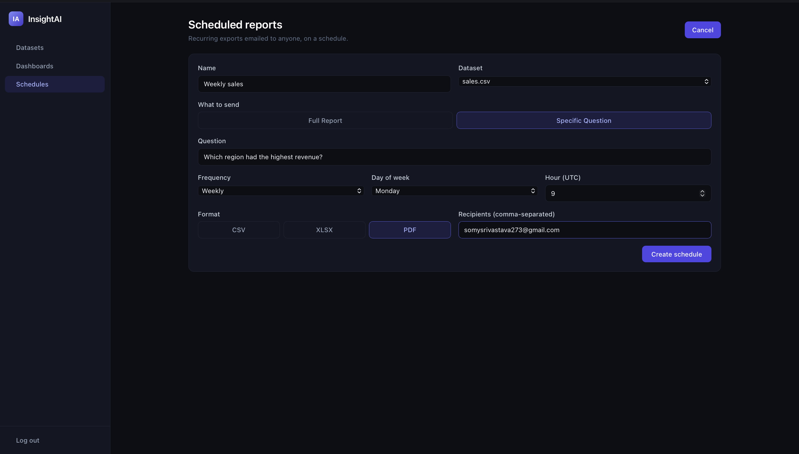

</td>
<td width="50%">

**Manage schedules**
<br>
See every recurring report, run one early, or delete it.
<br><br>
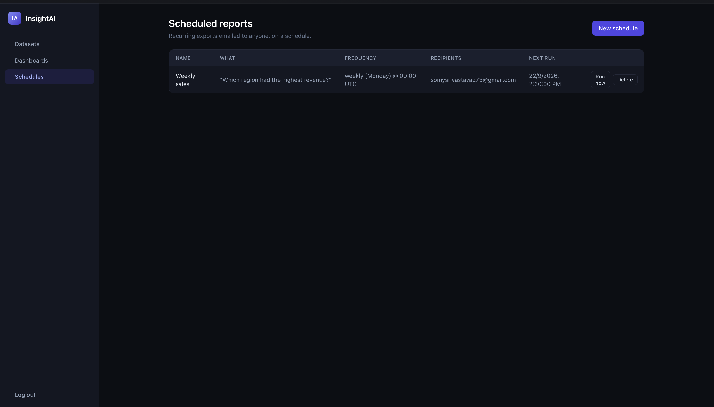

</td>
</tr>
<tr>
<td width="50%">

**The email that actually arrives**
<br>
A real scheduled report, delivered by Celery Beat + SendGrid, with
a PDF attached.
<br><br>
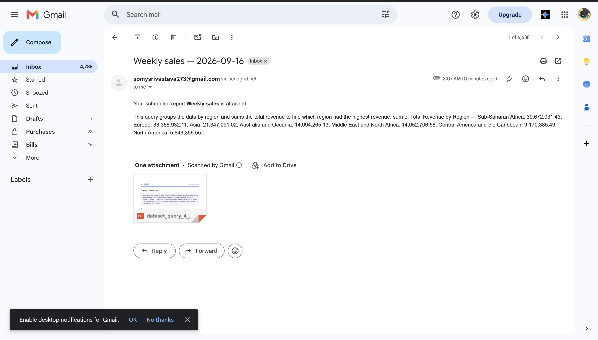

</td>
<td width="50%">

**The PDF itself**
<br>
Styled, branded, one click away from a slide deck.
<br><br>
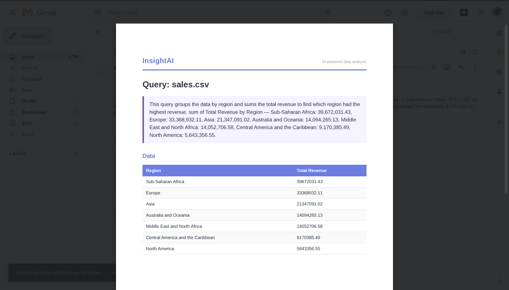

</td>
</tr>
</table>

## Features

- **Upload any CSV or Excel file** — no schema setup, no SQL. A
  multi-sheet Excel file becomes one dataset per sheet automatically.
- **Ask questions in plain English** — get a written answer, a chart,
  and the underlying data table, computed from the real dataset every
  time (never invented by the model).
- **Column mapping / data dictionary** — tell InsightAI what a column
  actually means so its answers use your team's language, without
  renaming anything in the source file.
- **Data versioning** — push a new snapshot of a dataset over time,
  roll back to any past version, with full history preserved.
- **Multi-dataset joins** — ask questions that span more than one
  file, joined and queried in plain English.
- **Scheduled reports** — recurring exports (daily/weekly/monthly)
  emailed automatically to anyone, in CSV, Excel, or PDF.
- **Anomaly detection & alerts** — threshold and statistical (z-score)
  checks on any metric, emailed the moment something looks off.
- **Dashboards** — pin any answer, chart, or report as a live,
  refreshable tile the whole team can see.
- **Bulk upload** — up to 50 files in one request, each processed and
  reported on independently.
- **One-click export** — CSV, Excel, or a styled PDF for every answer,
  report, or query.
- **Multi-tenant workspaces** — every dataset and every feature is
  scoped to a workspace, the natural boundary for team plans.
- **Async by default** — every slow operation (AI queries, exports,
  bulk upload) has a non-blocking background-job counterpart with
  status polling.
- **Rate limiting & caching** — every endpoint protected by default,
  analytics/AI/report results cached so a repeated question is
  instant.

## Architecture

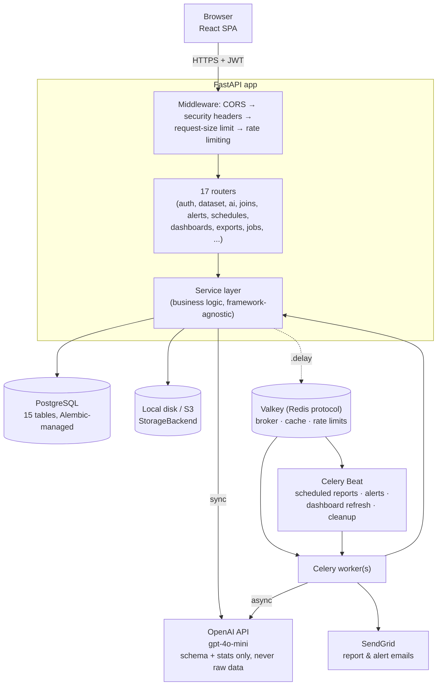

## Tech stack

| Layer | Technology | Why |
|---|---|---|
| API framework | FastAPI | Async-first, Pydantic validation built in, auto-generated OpenAPI docs used for real manual testing throughout this project |
| Database | PostgreSQL 16 | 6 models use JSONB (saved joins, dashboard pins, alert recipients, ...) — indexed, binary-stored, and genuinely queryable, unlike MySQL's JSON type |
| ORM / migrations | SQLAlchemy 2.x + Alembic | Every schema change is a real, versioned migration — not `create_all()`, which can't alter existing tables or backfill data |
| Background jobs | Celery + Valkey (Redis protocol) | Task queue, result backend, and a scheduler (Beat) in one library; Valkey is a license-clean, protocol-compatible drop-in for Redis |
| File storage | `StorageBackend` abstraction | One interface, two implementations (local disk / S3) — swapping the active backend is a one-line env var change, not a five-file hunt |
| AI layer | OpenAI `gpt-4o-mini` | Parses a question into a structured query against a strict JSON schema — it never touches the data and never writes the final answer itself |
| PDF export | WeasyPrint | Renders the same HTML template every export already uses into a styled PDF, no parallel PDF-specific layout code |
| Rate limiting | slowapi | FastAPI-native — one middleware registration covers every route by default, ~15 endpoints override with a stricter tier |
| Email | SendGrid | Scheduled report and alert delivery |
| Frontend | React 18 + TypeScript + Vite + Tailwind + React Query + Recharts | Type-safe, fast dev loop, server-state caching, and charting that matches the AI query response shape directly |
| Auth | JWT (python-jose) + bcrypt | Stateless tokens, no session store needed for a single-server deployment |
| Containerization | Docker Compose | One command (`docker compose up`) brings up the full stack — API, worker, scheduler, database, cache, frontend |

## Quick start

Requires Docker and Docker Compose.

```bash
git clone <this-repo>
cd insight-ai
cp .env.example .env   # fill in a real SECRET_KEY, and OPENAI_API_KEY if you want AI queries to work

docker compose up
```

This brings up the full stack: the API (`localhost:8000`), the React
frontend (`localhost:5173`), a Celery worker, Celery Beat, PostgreSQL,
and Valkey — migrations run automatically before the API starts.

Open `localhost:5173`, sign up, upload a CSV, and ask it a question.

## Tests

```bash
docker compose run --rm test
```

**205 tests passing · 83.72% overall line coverage · 100% coverage on
every security- and financial-critical path** (access control, auth,
KPI computation, anomaly detection) — enforced in CI on every push, not
just measured. Real Postgres and Redis in the test environment, not
mocks; only OpenAI, SendGrid, and S3 are ever mocked.
